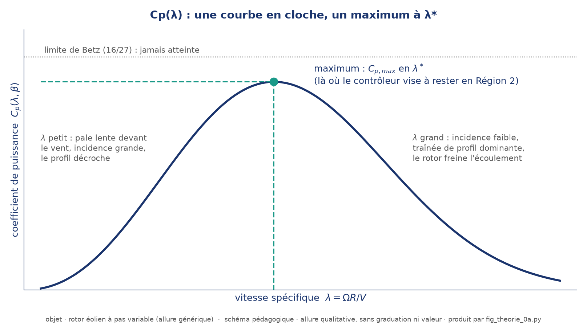
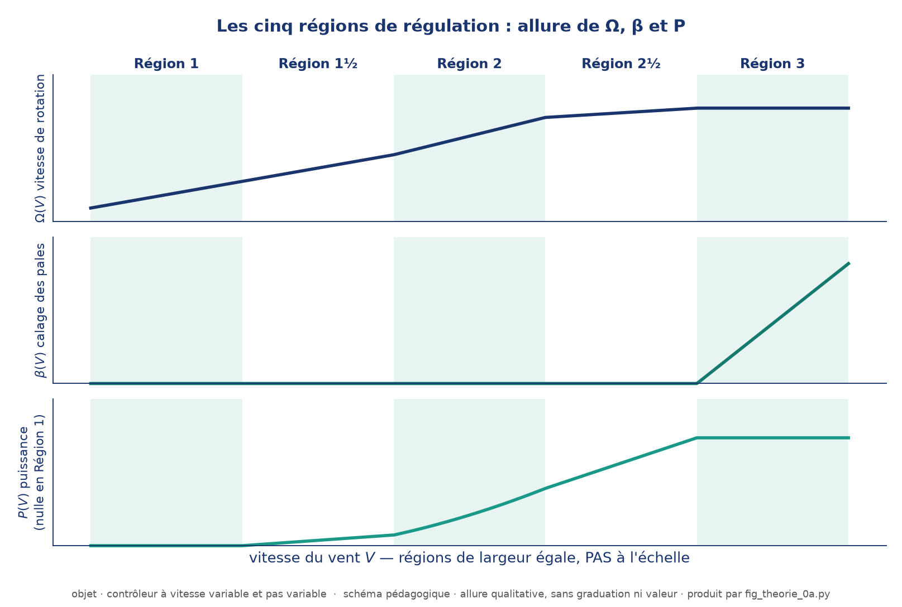
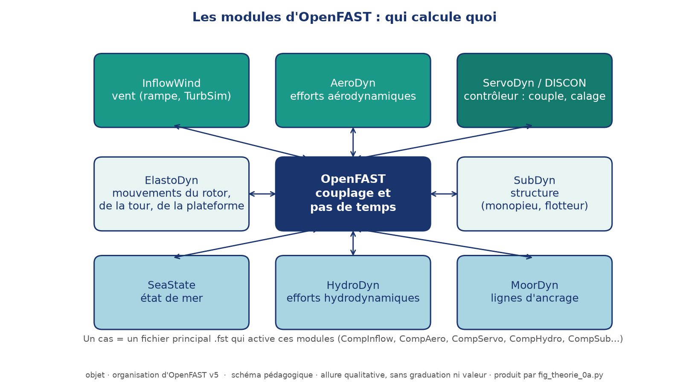
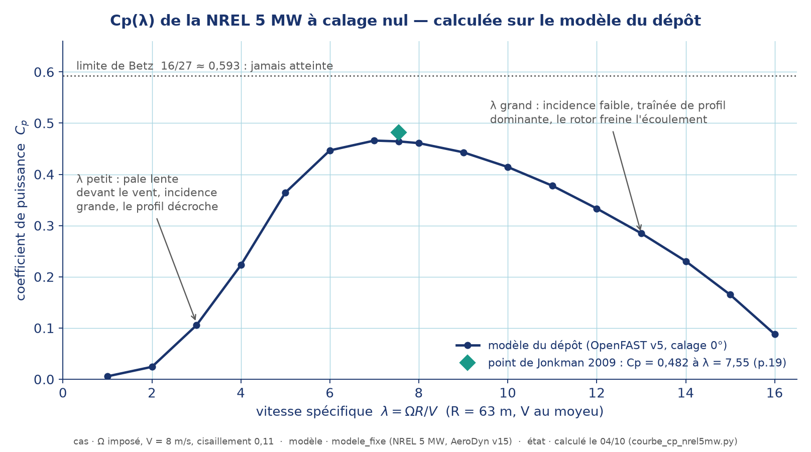
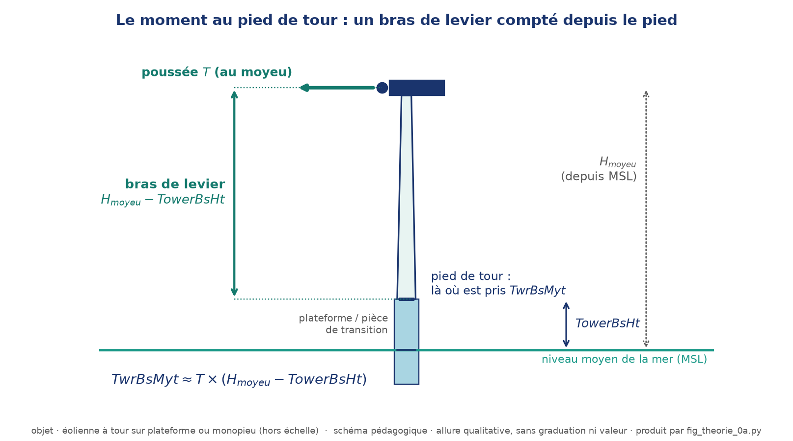
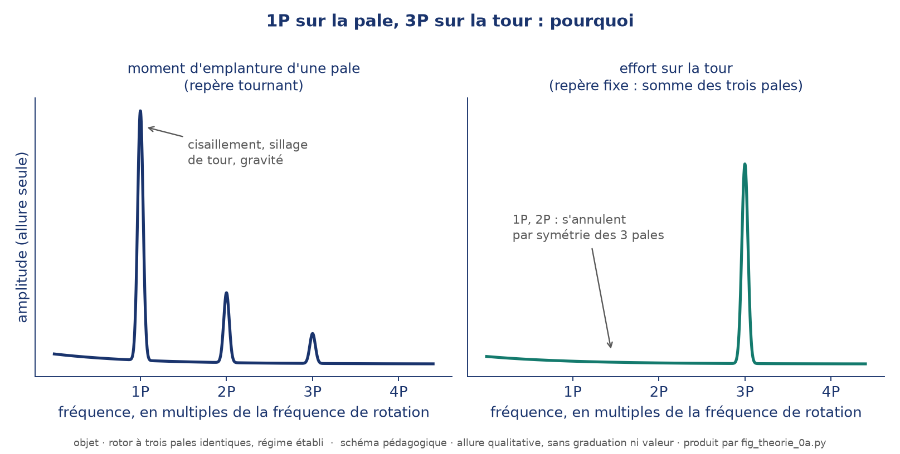

<!-- destinations: github, word -->
# Fiche F1 — Aérodynamique et régulation de l'éolienne

**À lire avant** : phase 0 (prise en main OpenFAST, cas F01-F02).

## Pourquoi

Les cas `F01`/`F02` du tutoriel `prise_en_main/` font tourner une éolienne à vitesse de vent
imposée et vous donnent en sortie `RotSpeed`, `GenPwr`, `TwrBsMyt`. Sans ces notions, ces
nombres sont des courbes sans signification : vous ne pouvez ni les prévoir avant de lancer le
calcul, ni juger s'ils sont physiquement plausibles une fois le calcul fini. C'est le contrôle le
plus simple et le plus rapide que vous ferez sur chaque cas de ce projet.

## Minimum vital

**Théorie du disque actuateur (Betz)** : un rotor extrait une puissance
`P = 1/2 · ρ · A · V³ · Cp(λ, β)`, où `A = πR²` est la surface balayée, `V` la vitesse du vent
non perturbé, `Cp` le coefficient de puissance (limite théorique de Betz : `Cp,max = 16/27 ≈
0,593`, jamais atteinte en pratique — pertes de bout de pale, trainée de profil). `Cp` dépend de
deux paramètres pilotés par la machine :
- **λ (TSR, tip-speed ratio)** = `Ω·R / V` (Ω en rad/s) — rapport entre la vitesse de bout de
  pale et la vitesse du vent ;
- **β** — l'angle de calage des pales (pitch).

La poussée axiale (ce qui charge la tour en flexion) suit la même logique :
`T = 1/2 · ρ · A · V² · Ct(λ, β)`, avec `Ct` du même ordre de grandeur que `Cp` (typiquement
`Ct ≈ 0,7-0,9` en-dessous du régime nominal).

*Figure 1 — Allure de `Cp(λ)` (qualitative, sans graduation). Le maximum est en `λ*` ; la courbe est
plate autour : un écart modéré de `λ` coûte peu de puissance.*

**Les zones de régulation** d'une machine à vitesse variable, pitch variable (c'est le cas de la
NREL 5 MW de ce projet) ; Jonkman 2009 en distingue cinq (1, 1½, 2, 2½, 3), et le contrôleur
du modèle les met toutes en œuvre. Elles se repèrent à la **vitesse de rotation côté génératrice**
(`Ω_gen = 97 · Ω_rotor`, multiplicateur 97:1) :
- **Region 1** (sous `VS_CtInSp`) : couple générateur nul : aucune puissance électrique (`P = 0`), le rotor accélère sous l'effet du vent (Jonkman 2009, §7.2 p.19 : la Region 1 précède le cut-in).
- **Region 1½** (entre `VS_CtInSp` et `VS_Rgn2Sp`) : transition de démarrage — le couple suit une
  **rampe linéaire** qui part de zéro à `VS_CtInSp` et rejoint la loi de Region 2 à `VS_Rgn2Sp`.
  La rampe est raide : la vitesse reste confinée dans cette bande étroite, et la machine produit
  déjà de la puissance. Ce n'est pas une zone « de tout petit vent » : elle s'étend jusqu'à un vent
  que **vous calculerez** (voir « Méthode »).
Les trois suivantes :
- **Region 2** (de `VS_Rgn2Sp` jusqu'au régime nominal) : pitch fixe (souvent proche de 0°), le couple
  générateur est piloté pour maintenir `λ` à sa valeur de consigne `λ*` (la valeur de conception de Jonkman, 7,55, pour laquelle le gain `VS_Rgn2K` est réglé ; la courbe `Cp(λ)` est plate au voisinage de son maximum) —
  la vitesse de rotation suit donc le vent : `Ω(V) = λ*·V/R`.
- **Region 3** (au-dessus du vent nominal) : la puissance est plafonnée à la puissance nominale,
  `Ω` est maintenue constante (régime nominal), c'est le **pitch** qui augmente pour réduire `Cp`
  et évacuer l'excès de puissance.
- **Region 2½** (transition, zone étroite) : la loi de Region 2 ferait dépasser la vitesse de
  rotation nominale avant même d'atteindre le vent nominal ; cette région limite donc le couple
  pour plafonner `Ω` à sa valeur nominale un peu plus tôt — chez Jonkman, la raison d'être
  explicite est de limiter la vitesse de bout de pale (et le bruit associé), pas seulement le
  couple générateur.

*Figure 2 — Allure de `Ω`, `β` et `P` par région (régions de largeur égale, pas à l'échelle : aucune
vitesse de vent n'est lisible, à vous de calculer les frontières). La version à l'échelle, sur axes physiques, ne montre que les données publiées de Jonkman 2009 : la zone entre le cut-in et le vent nominal y reste volontairement vide : c'est l'objet de Q0.1, qui demande les frontières intérieures 1½/2 et 2/2½ ; 3 et 11,4 m/s sont des données.*

*Figure 3 — Qui calcule quoi dans OpenFAST. Le contrôleur (ServoDyn / DISCON) est celui dont on étudie
ici les régions.*

## Ordre de grandeur sur la NREL 5 MW (DeepCwind et monopile OC3)

| Grandeur | Valeur | Source |
|---|---|---|
| Rayon rotor R | 63 m | Jonkman 2009, Tab. 1-1 (diamètre 126 m) ; la valeur précise de 62,94 m, précône inclus, se déduit du texte p.3 |
| Puissance nominale | 5 MW | idem |
| Vitesse de rotation nominale | 12,1 tr/min (≈ 1,267 rad/s) | idem |
| Vitesse de vent nominale | 11,4 m/s | idem |
| Cut-in / cut-out | 3 m/s / 25 m/s | idem |
| Multiplicateur (rapport rotor → génératrice) | 97:1 | Jonkman 2009, p.14 |
| Vitesses génératrice des seuils : début de Region 1½ `VS_CtInSp` / début de Region 2 `VS_Rgn2Sp` | 70,16 rad/s / 91,21 rad/s (côté génératrice) | `DISCON.F90` du dépôt ; Jonkman 2009, p.19 (670 et 871 tr/min) |
| λ* (TSR optimal, Region 2) | 7,55 | Jonkman 2009, §7.2 p.19 et Tab. 7-2 p.27 |
| Cp maximal (à λ* et calage 0°) | 0,482 | Jonkman 2009, §7.2 p.19 |

**Méthode** : en Region 2, `Ω attendu = λ*·V/R` (rad/s), à convertir en tr/min (`× 60/(2π)`).
**Avant d'appliquer cette loi, vérifiez la région** : convertissez les deux seuils de la table
(côté génératrice) en vitesse de rotor, puis comparez à votre `Ω` calculé. Sous le seuil de
Region 2, c'est la rampe de Region 1½ qui gouverne, et la loi `λ*·V/R` n'en est qu'une approximation
(voir le point de cours du §5 de `seances/0a/README.md`). La conversion d'un seuil de vitesse de rotation
en vitesse de vent par `λ*` n'a de sens qu'**au seuil de Region 2**, là où la rampe rejoint la loi de Region 2 :
plus bas, la rampe tient la vitesse dans sa bande et la loi `λ*·V/R` sous-estime `Ω`. La loi ne s'applique plus au-dessus du
régime nominal — **à vous de calculer à quelle vitesse de vent ce régime est atteint**, et de comparer ce résultat au vent
nominal (11,4 m/s) : si les deux diffèrent, c'est que la Region 2½ s'intercale entre les deux,
avant la Region 3.

## Region 1½ : la loi de la rampe, la courbe `Cp(λ)` et l'équilibre des couples

En Region 2 la loi `λ*·V/R` donne `Ω` directement. **En Region 1½ elle ne suffit pas** : la rampe de couple
impose une bande de vitesse et `Ω` se *calcule* par un équilibre. Trois ingrédients, tous donnés ici.

**1. La loi de couple du contrôleur** (donnée d'entrée, `DISCON.F90` : `VS_Slope15` ligne 175, couples
lignes 383-391), côté génératrice, avec `ω_g = N·Ω` (rad/s, `N = 97`) :

| Région | Couple générateur `Q_gen(ω_g)` (N·m, côté génératrice) |
|---|---|
| 1 : `ω_g ≤ VS_CtInSp` | `0` |
| 1½ : `VS_CtInSp < ω_g < VS_Rgn2Sp` | `VS_Slope15 · (ω_g − VS_CtInSp)`, avec `VS_Slope15 = VS_Rgn2K · VS_Rgn2Sp² / (VS_Rgn2Sp − VS_CtInSp)` |
| 2 : au-dessus, jusqu'à la Region 2½ | `VS_Rgn2K · ω_g²` |

avec `VS_CtInSp = 70,16224 rad/s`, `VS_Rgn2Sp = 91,21091 rad/s`, `VS_Rgn2K = 2,332287 N·m/(rad/s)²`.
Côté rotor, le couple équivalent est `N · Q_gen(N·Ω)`.

**2. La courbe `Cp(λ)` de la NREL 5 MW à calage nul.** Jonkman 2009 ne donne que le point maximal (`Cp = 0,482`
à `λ = 7,55`, §7.2 p.19). La courbe ci-dessous est **calculée sur le modèle du dépôt** (OpenFAST v5.0.0, AeroDyn v15,
rotor à vitesse imposée, calage 0°, `V` = 8 m/s au moyeu, cisaillement 0,11 comme F01 ; script
`outils/courbe_cp_nrel5mw.py`, données `data/cp_lambda_nrel5mw_pitch0.csv`). Son maximum (≈ 0,47 vers `λ = 7`) est inférieur de 3 à 4 % au point de Jonkman. Variables qui diffèrent
d'un calcul de Jonkman : outil (AeroDyn v15 de ce dépôt), cisaillement 0,11, ombre de la tour, inclinaison de l'arbre et
précône du modèle du dépôt ; pales rigides ici. On utilise donc la courbe du dépôt, plate entre `λ = 7` et `λ = 8`, pour rester cohérent avec les cas F01 et F02. Interpolation : linéaire ou spline, au choix (écart sans effet sur le résultat à 1 % près).

| λ | Cp |
|---:|---:|
| 1 | 0,006 |
| 2 | 0,024 |
| 3 | 0,105 |
| 4 | 0,223 |
| 5 | 0,364 |
| 6 | 0,447 |
| 7 | 0,466 |
| 7,55 | 0,464 |
| 8 | 0,461 |
| 9 | 0,443 |
| 10 | 0,414 |
| 11 | 0,378 |
| 12 | 0,333 |
| 13 | 0,285 |
| 14 | 0,231 |
| 15 | 0,165 |
| 16 | 0,088 |

*Figure 6 — `Cp(λ)` du modèle du dépôt à calage nul. Contrairement aux figures 1 à 5, celle-ci est chiffrée :
c'est une courbe de la machine, pas une réponse de rendu.*

**3. La méthode d'équilibre.** À vent `V` fixé, la vitesse d'équilibre `Ω` vérifie l'égalité des couples,
ramenés côté rotor :

`Q_aéro(Ω) = ½ ρ π R² V³ · Cp(ΩR/V) / Ω  =  N · Q_gen(N·Ω)`.

Deux façons de la résoudre : **graphiquement** (tracer les deux membres en fonction de `Ω`, l'intersection est le
point de fonctionnement) ou **par itération** (partir d'un `Ω` plausible, évaluer l'écart des deux couples, corriger
`Ω` dans le sens qui le réduit — bissection ou Newton). Lire `Cp` par interpolation dans le tableau. Pour la
**puissance** : `P_élec = η · N · Q_gen(N·Ω) · Ω` (rendement électrique `η = 0,944`, Jonkman 2009). En Region 2, la même
méthode s'applique, avec le couple en `ω_g²`. *Q0.1 exige `Ω` dans chaque région : loi `λ*·V/R` en Region 2, équilibre des
couples en Region 1½.*

## Confrontation OpenFAST

Pour le cas F01 du tutoriel (vent constant) : **identifiez d'abord sa région** (méthode ci-dessus),
puis calculez `Ω` attendu et comparez-le au `RotSpeed` observé en régime établi. Un écart tolérable est attendu
(la loi de couple réelle du contrôleur ne colle pas parfaitement à `λ*` à toutes les vitesses), et
il y a un régime transitoire au démarrage à écarter de la moyenne (cf `outils/lire_outb.py`,
option `t_min`). Si l'écart dépasse ~15-20 %, suspectez d'abord le transitoire inclus dans la
moyenne, pas une erreur de configuration.

Pour `TwrBsMyt` (moment fléchissant en pied de tour) : estimez la poussée
`T = 1/2 · ρ · A · V² · Ct` (air `ρ ≈ 1,225 kg/m³`, `Ct ≈ 0,8` sous le régime nominal à défaut de valeur
précise tirée du modèle) puis `TwrBsMyt ≈ T × (H_moyeu − TowerBsHt)` : `TwrBsMyt` est le moment **au pied de la tour**,
dont la hauteur `TowerBsHt` (à lire dans `config_elastodyn.dat`) est le point de référence du bras de
levier — pas le niveau de la mer. Comparez à ±20 % : le modèle complet
inclut en plus le poids propre de la nacelle/tour en flexion et la variation de `Ct` avec `λ`.

*Figure 4 — `TwrBsMyt` est pris au pied de la tour : le bras de levier de la poussée est
`H_moyeu − TowerBsHt`.*

**Fréquence 1P** : une pale fait un tour en `1/f` ; la fréquence de rotation est
`f₁ₚ = RotSpeed / 60` (Hz, `RotSpeed` en tr/min). Chaque pale traverse à chaque tour le même
cisaillement de vent, le même sillage de tour et subit la même gravité : ses moments d'emplanture
(`RootMyb1`, hors plan ; `RootMxb1`, dans le plan, surtout par la gravité) oscillent à 1P. La tour, elle, ne voit que la somme des trois pales, déphasées de 120° :
les harmoniques qui ne sont pas multiples de 3 se compensent, il reste 3P (bloc Théorie du §6 de
`seances/0a/README.md`).

*Figure 5 — Spectres qualitatifs : la pale voit 1P (et ses harmoniques), la tour ne garde que les
multiples du nombre de pales.*

## Exemple résolu — IEA 15 MW (éolienne de référence, monopieu)

Une autre machine que celle du projet, pour voir la démarche en entier sans toucher aux valeurs de
la NREL 5 MW. **Données lues dans Gaertner et al. 2020** (NREL/TP-5000-75698), pages indiquées :
diamètre de rotor 240 m, hauteur de moyeu 150 m, hauteur de la pièce de transition 15 m (Tab. ES-1
p.iv) ; vitesse de rotation minimale 5 rpm, rotor au régime nominal 7,55 rpm ; vent nominal
10,59 m/s ; seuil 6,98 m/s entre le régime de vitesse minimale et la Region 2 (§3.1 p.17) ;
`λ*` de conception 9,0, `Cp` de conception 0,489, `Ct` de conception 0,799 (Tab. ES-2 p.vi) ;
première fréquence propre tour-monopieu 0,17 Hz, entre 1P et 3P (§4 p.21). **Hypothèses de
l'exemple** : `ρ = 1,225 kg/m³` (valeur courante, non lue dans le rapport) ; pied de tour pris au
sommet de la pièce de transition (15 m au-dessus du niveau moyen) ; `Ct` pris à sa valeur de
conception.

**Cas : `V = 8 m/s`.**

1. *Données.* `R = 120 m`, `A = πR² ≈ 45 239 m²`.
2. *Ω attendu et région.* `Ω = λ*·V/R = 9 × 8 / 120 = 0,600 rad/s`, soit `0,600 × 60/(2π) ≈ 5,73 rpm`.
   Comparée au minimum de 5 rpm : au-dessus, donc la loi `λ*` s'applique (région de suivi du `λ`
   optimal, entre 6,98 et 10,59 m/s : 8 m/s y est).
   *Contrôle de cohérence* : au seuil `V = 6,98 m/s`, la même formule donne `9 × 6,98/120 × 60/(2π) ≈ 5,00 rpm`,
   le minimum ; à `V = 10,59 m/s`, `≈ 7,58 rpm`, à 0,4 % du régime nominal du rapport (7,55 rpm).
3. *Poussée.* `T = ½ ρ A V² Ct = 0,5 × 1,225 × 45 239 × 8² × 0,799 ≈ 1 417 kN`.
4. *Moment au pied.* Bras `H_moyeu − z_pied = 150 − 15 = 135 m`, donc
   `M ≈ 1 417 × 135 ≈ 191 MN·m`.
5. *1P et 3P.* `f₁ₚ = 5,73/60 ≈ 0,096 Hz`, `f₃ₚ ≈ 0,29 Hz`. La fréquence propre du rapport (0,17 Hz) est
   bien entre les deux ; elle l'est à tout régime de 5 à 7,55 rpm (1P de 0,083 à 0,126 Hz, 3P de
   0,25 à 0,38 Hz) — c'est la raison du choix du régime minimal (§3.1 p.17).

**Le même exemple, mais `V = 5 m/s`.** `λ*·V/R = 9 × 5/120 = 0,375 rad/s ≈ 3,58 rpm`, **sous** le
minimum de 5 rpm : la machine ne suit pas la loi `λ*` mais tient la vitesse minimale. Son `λ`
réel est `5 × (2π/60) × 120 / 5 ≈ 12,6`, très au-dessus de `λ*` : c'est la région de vitesse minimale
du rapport, appelée Region 1.5 (§3.2 p.18 : tip-speed ratios nettement plus élevés que l'optimal). Même leçon que pour la
NREL 5 MW : **on vérifie la région avant d'appliquer la loi de Region 2.**

## Exercices gradués (non notés, corrigé publié)

Sur l'IEA 15 MW, mêmes données et hypothèses que ci-dessus. Corrigé :
[`F1_exercices_IEA15_corriges.md`](F1_exercices_IEA15_corriges.md). Essayez avant de regarder.

1. *(Niveau 1)* `V = 9 m/s` : `Ω` (rad/s et rpm), région.
2. *(Niveau 1)* `V = 6 m/s` : `Ω` selon `λ*`, comparer au minimum ; quelle région ? quel `λ` réel ?
3. *(Niveau 2)* `V = 10 m/s` : poussée, moment au pied (bras `H_moyeu − z_pied`), puissance aérodynamique
   `½ ρ A V³ Cp` avec `Cp = 0,489` — comparer à la puissance nominale de 15 MW.
4. *(Niveau 2)* Vérifier que la fréquence propre de 0,17 Hz reste entre 1P et 3P à 5 rpm et à 7,55 rpm.
5. *(Niveau 3)* Un collègue annonce un moment de `M ≈ T × 150` pour le cas de l'exercice 3. Quelle erreur,
   de combien en pour cent, et pourquoi la tolérance habituelle de ±20 % l'aurait-elle laissée passer
   ou non ?

<!-- DTU : emplacements réservés, invisibles des étudiants — matière du cours construit avec le DTU, future source du master DMO-S9
     (aéro-régulation). Crédit à inscrire quand la matière entrera : « Technical University of Denmark (DTU) — https://www.dtu.dk/english ».
[DTU:BEGIN D1] D1. Aérodynamique du rotor (BEM, Cp(λ, β) détaillée) [DTU:END D1]
[DTU:BEGIN D2] D2. Contrôle et régulation (lois de couple, calage, régions, ROSCO / DISCON) [DTU:END D2]
[DTU:BEGIN D3] D3. Charges et fréquences (1P/3P, diagramme de Campbell, résonances) [DTU:END D3]
-->

## Limites

- La théorie du disque actuateur est **1D et stationnaire** : elle ignore la rotation du
  sillage, les pertes de bout/pied de pale, les effets tridimensionnels le long de la pale. Le
  BEM (Blade Element Momentum), utilisé par AeroDyn, les ajoute mais reste lui-même une théorie
  d'ingénieur calée empiriquement (facteurs de correction de Prandtl, Glauert), pas une
  simulation CFD.
- Les cas `F01-F05` de ce tutoriel tournent en **BEMT quasi-stationnaire (`Wake_Mod=1`), pas en
  DBEMT (`Wake_Mod=2`)** — le modèle dynamique du sillage n'est pas actif. En vent turbulent ou
  en régime transitoire rapide (échelon de F02), la réponse aérodynamique instantanée peut
  différer d'un calcul DBEMT ou d'une mesure réelle (cf `tutorials/prise_en_main/README.md`).
- Le `Ct ≈ 0,8` de l'estimation de poussée est un ordre de grandeur usuel, **pas une valeur tirée d'une table
  `Ct(λ,β)` du modèle** (sortie `RtAeroCt` d'AeroDyn). La courbe `Cp(λ)` à calage nul, elle, est calculée sur le
  modèle du dépôt (section « Region 1½ ») ; seul le calage 0° est couvert, pas `Cp(λ, β)` complète.

## Pièges

- Confondre `Ω` en rad/s et en tr/min dans le calcul de `λ` (facteur `60/(2π) ≈ 9,55`).
- Appliquer la loi de Region 2 sans avoir **vérifié la région** : sous le seuil de Region 2 (rampe
  de Region 1½), le contrôleur ne suit pas cette loi ; la machine y produit déjà, ne la déclarez pas
  « à l'arrêt » ni « en Region 2 » par réflexe parce que le vent est inférieur au vent nominal.
- Appliquer la loi Region 2 (`Ω = λ*·V/R`) au-delà du vent où elle fait atteindre le régime
  nominal : `Ω` ne continue pas à croître avec `V` au-delà de ce point, elle est plafonnée dès la
  Region 2½ — qui commence **avant** le vent nominal (11,4 m/s, début de la Region 3), pas à
  partir de lui.
- Moyenner `RotSpeed`/`GenPwr` sur toute la durée simulée, transitoire de démarrage inclus — biais
  systématique signalé dans `outils/lire_outb.py` (argument `t_min`).
- Oublier que `Ct` n'est pas constant : il décroît avec `λ` au-delà de l'optimum — une estimation
  de poussée à `Ct = 0,8` devient fausse en Region 3 (le pitch réduit fortement `Ct`).

## Auto-test

1. Pour `V = 9 m/s`, avec `λ* = 7,55` et `R = 63 m`, quelle vitesse de rotation `Ω` (en tr/min)
   attendez-vous en Region 2 ?
2. L'éolienne tourne en Region 3 à puissance nominale 5 MW et vitesse nominale 12,1 tr/min. Quel
   couple sur l'arbre lent, côté rotor (en kN·m), cela représente-t-il ? (`P = T · Ω`, `Ω` en rad/s ; le couple
   côté génératrice s'en déduit par le multiplicateur)
3. Avec `ρ = 1,225 kg/m³`, `R = 63 m`, `Ct = 0,8`, estimez la poussée du rotor `T` (en kN) à
   `V = 10 m/s`, puis l'ordre de grandeur du moment `TwrBsMyt` attendu avec une hauteur de moyeu
   de 90 m et un pied de tour à `TowerBsHt` = 10 m au-dessus du niveau de la mer.

## Sources

- J. Jonkman, S. Butterfield, W. Musial, G. Scott, *Definition of a 5-MW Reference Wind Turbine
  for Offshore System Development*, NREL/TP-500-38060, 2009 — paramètres de la machine (R,
  puissance/vitesse nominales, cut-in/out, λ* et Cp max §7.2 et Tab. 7-2).
- E. Gaertner, J. Rinker, L. Sethuraman, F. Zahle, B. Anderson, G. Barter, N. Abbas, F. Meng,
  P. Bortolotti, W. Skrzypinski, G. Scott, R. Feil, H. Bredmose, K. Dykes, M. Shields, C. Allen,
  A. Viselli, *Definition of the IEA 15-Megawatt Offshore Reference Wind Turbine*,
  NREL/TP-5000-75698, 2020 — données de l'exemple résolu (Tab. ES-1 p.iv, Tab. ES-2 p.vi, §3.1 p.17,
  §3.2 p.18, §4 p.21).
- M. O. L. Hansen, *Aerodynamics of Wind Turbines*, Routledge — *référence générale, non consultée page par page pour cette fiche* — théorie du disque actuateur et
  BEM (relation de référence, formule, pas de reproduction de texte).
- J. F. Manwell, J. G. McGowan, A. L. Rogers, *Wind Energy Explained*, Wiley — *référence générale, non consultée page par page pour cette fiche* — définitions
  TSR/Cp/Ct et zones de régulation (relation de référence).
- `models/oc4_rtest/5MW_Baseline/ServoData/DISCON/DISCON.F90` (`VS_CtInSp`, `VS_Rgn2Sp`,
  `VS_Rgn2K`) — seuils des régions 1½ et 2 et loi de couple de Region 2 effectivement utilisés dans ce dépôt ; `models/oc4_rtest/5MW_OC4Semi_WSt_WavesWN/
  NRELOffshrBsline5MW_OC4DeepCwindSemi_ServoDyn.dat` pour les paramètres ServoDyn du cas flottant
  de référence.
